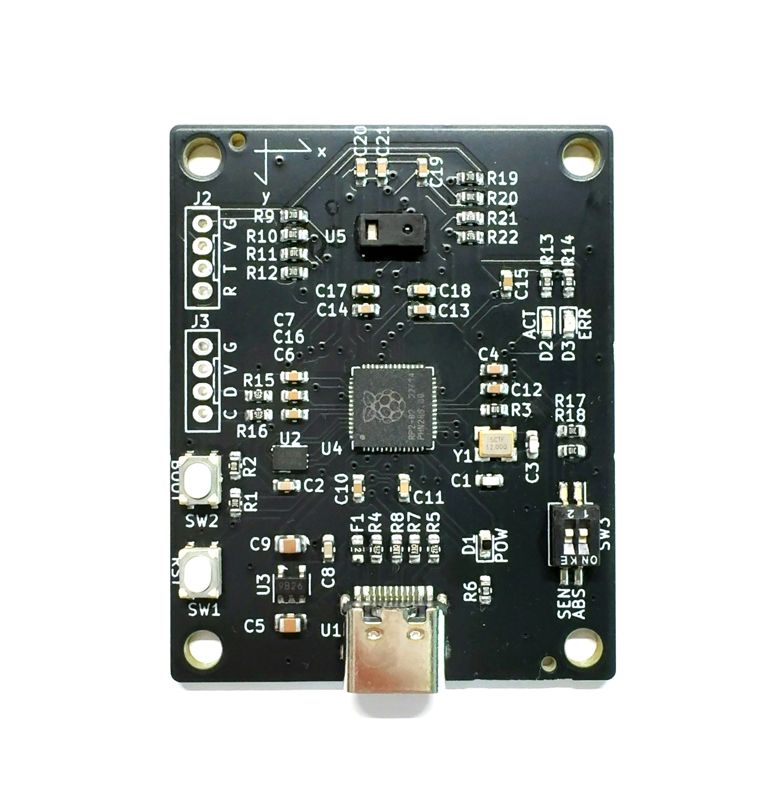
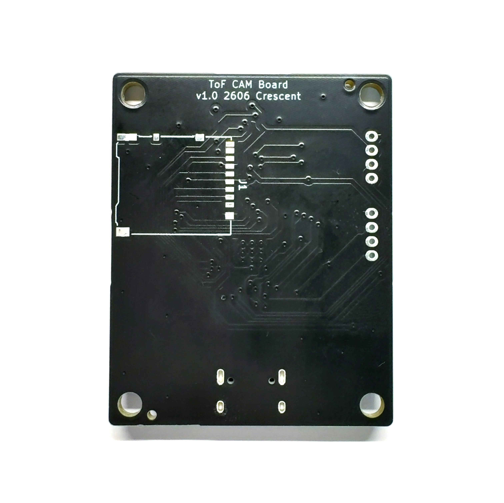
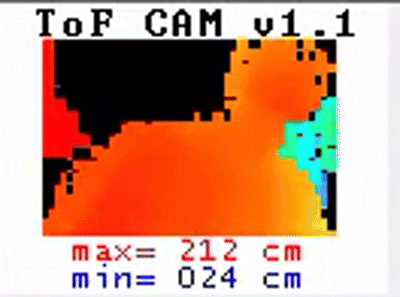

# ToF UVC Camera Board

## Overview 
  * This is a ToF camera board equipped with the [AMS TMF8829 ToF sensor][1].  
  * Outputs 48x32 ToF data as a UVC webcam image.  
  * The microcontroller used is the RP2040.  
  * Source code using the Pico-SDK is available.
  * Measuring up to 1.4 m in high-resolution mode and up to 5.7 m in standard mode.

## Detailed Specifications
  * The USB port uses a Type-C connection.
  * The board is recognized as a UVC (USB Video Class) device with a resolution of 128x96.
  * The ToF resolution is 48x32 as a UVC webcam image.
  * It is displayed scaled up by a factor of two(96x64).
  * Measuring up to 1.4 m in high-resolution mode(SW3 SEN ON)
  * Measuring up to 5.7 m in standard mode(SW3 SEN OFF)
  * Switch the color scale between absolute(SW3 ABS ON) and relative modes(SW3 ABS OFF).
  * In the relative mode, the color scale is calculated based on the overall maximum and minimum values.
  * For absolute mode, the color scale is calculated based on a minimum of 0 and a maximum of 1.4 m in high-resolution mode, or 5.7 m in normal mode.
  * If horizontally flip the output image, please flash the `UVC_RP2040_XXXXXX_vXX_Mirror.uf2` file.
  * In the code, enable `MIRRR_OUTPUT_MODE` in `UVC_RP2040.h`.
  * If the confidence value is less than 10, it will be displayed in black. 
  * The frame rate depends on the conditions, but it is around 8 FPS.
  * 80° FOV, 1cm minimum distance and 0.25 mm resolution
  * Power 5V/0.2A from USB Type-C Port
  * The maximum range of 11m is supported only at 8x8 resolution; this board does not support it.
  * The board size is 40mm x50 mm, the hole size is M3x4, the hole pitch is 34mm x44mm. 

## Laser eye safety
The TMF8829 is designed to meet the Class 1 laser safety limits including single faults in
compliance with IEC / EN 60825-1:2014, EN 60825-1:2014+A11:2021 and Class 1 consumer
laser product according to EN 50689:2021.

## Updating the firmware
  * Connect the device to a PC (or similar) via USB Type-C.
  * Then press the RST button while holding down the BOOT button.
  * The device will be recognized as a USB drive.  
  * You can update the firmware by copying the firmware file(*.uf2) to the recognized USB drive.

## Appearance and examples

[1]: https://ams-osram.com/ja/products/sensor-solutions/direct-time-of-flight-sensors-dtof/ams-tmf8829-48x32-multi-zone-time-of-flight-sensor
